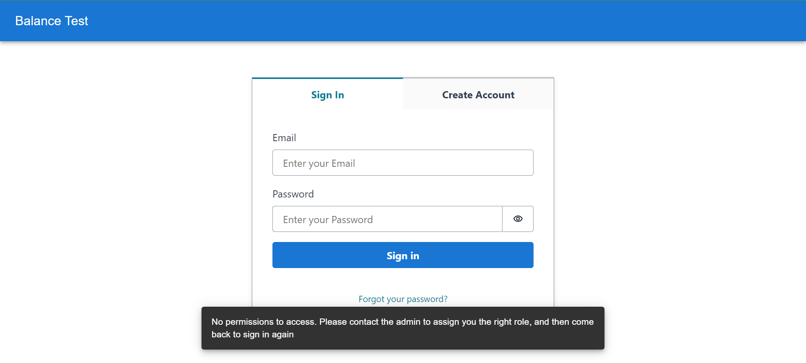
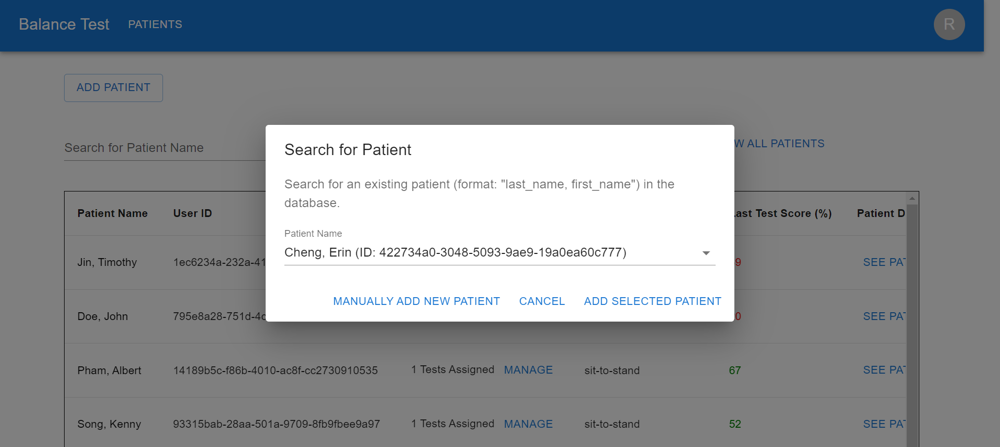
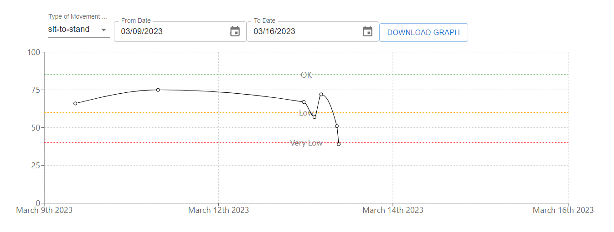
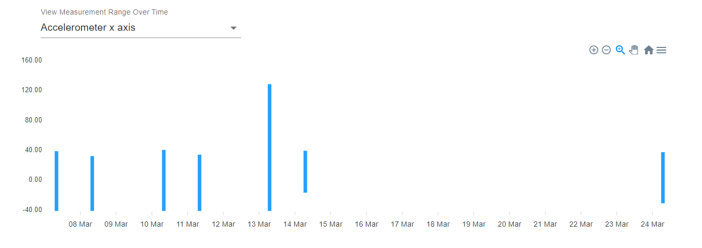
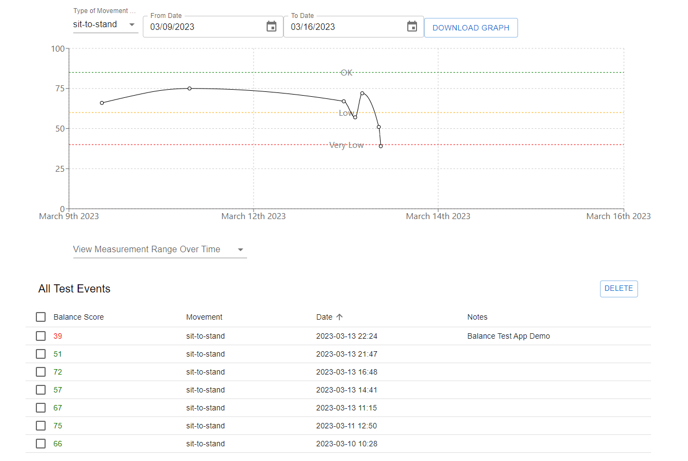
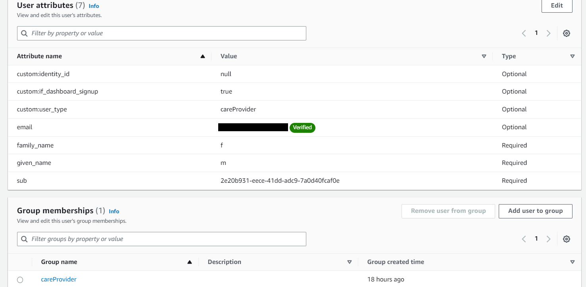

# User Guide

**Before Continuing with this User Guide, please make sure you have deployed the frontend and backend stacks, as well as any sensors you may have.**

  [Deployment Guides](./DeploymentGuide.md)

| Index                                                                                        | Description                                               |
|:---------------------------------------------------------------------------------------------|:----------------------------------------------------------| 
| [Sign In Or Create An Account](#Sign-In-Or-Create-An-Account)          | Sign in to a care provider account              |
| [Home](#Home)                                                            | How to see all patients overview                            |
| [Patient Details](#Patient-Details)                                                                    | See details for a patient                                         |
| [Test Event Details](#Test-Event-Details)  | See details for a test event                        |
| [Add User to CareProvider Group](#Add-User-to-CareProvider-Group)  | Grant user permission to the dashboard                        |

## Sign In Or Create An Account

First, either sign in or create an account.

You can create an account using your email address. Enter your preferred password, confirm password, then enter your first and last name.

Note: right after you create an account or if you created an account not too long ago, you may see the error below. In this case, ask your admin to give you permissions by following the [Add User to CareProvider Group](#Add-User-to-CareProvider-Group) section

## Home

The home page displays the list of patients assigned to you. 

To search for a patient, type their name in the Search for Patient Name search bar. Clicking on the ‘arrow’ symbol will also open a drop down with the list of patients, organized by last names. 

Click on the patient name you would like to view, and click the ‘search’ button to initiate the search function. To clear the search and view all patients, click on the ‘Show All Patients’ button.

To add patients, click on the ‘Add Patient’ button. This will open a pop-up that allows you to manually add a patient or find one that is registered in the database.

Clicking on the ‘Manually Add New Patient’ will open a pop up that requires you to fill out their first and last name. To add the patient, click on ‘Add New Patient’.

To add patients that are registered in the database, type their name on the Patient Name search box. Clicking on the ‘arrow’ symbol will also open a drop down menu with the patients’ names and IDs. Click on the patient you want to add, and click ‘Add Selected Patient’.

To assign a test to the patient, click on the ‘Manage’ button, then select the movement you want to assign, click the checkbox next to the movement name and click ‘Save’.

## Patient Details

To view a patient’s record, click on the ‘See Patient’ button. This will open a new page displaying test records of that patient. On the top of the page, you can view the weekly and monthly average, and how it changes over time. It also shows a graph that plots the patient test scores over a designated period of time. To change the time range, simply click on the button and select the date you prefer. 

In the score graph, the  y-axis of the graph represents the scores from 0-100 and the x-axis of the graph represents the datesTo download the score tracking graph, click on the ‘Download Graph’ button. A PDF file will be saved on your computer.

If you scroll down, you can view the patient's measurement range over time. Clicking on the ‘arrow’ symbol will open a drop down menu for you to select a specific IMU range graph.

The IMU data range graph displays the raw IMU data that was sent from the mobile app. It displays the range between the maximum and minimum values for each sensor component and each axis, such as accelerometer x-axis values, accelerometer y-axis values, and accelerometer z-axis values.

The y-axis of the IMU range graph represents the values for each sensor component:
accelerometer displays acceleration, gyroscope displays angular velocity, magnetometer displays magnetic field values. The x-axis of the range graph represents the date and time of the recordings

To download the IMU range graph, click on the ‘hamburger’ button on the right hand side. You can choose to download the graph as a single SVG, PNG, or CSV file.

The patient data page also shows the patient’s past test events, including their balance score, the type of movement, date when it was completed, and any notes saved. 

To delete a past test event, click on the checkbox beside the test you would like to delete and click on the ‘Delete’ button.

Clicking on the ‘Delete’ button will open a pop-up to confirm your choice.

## Test Details

To view a test event in the test event table. Click the test in the table and it will take you to the following page. It shows you the name of the patient, the test type, balance score, timestamp, and any notes left by the doctor or patient:

Click on the "Select a measurement to view raw data" to select a measurement to view graph for from the drop-down:

If you wish to save the test details information, click download. It will download the raw recordings as a csv, and the full details as a pdf file:

Below show the content of the files downloaded:
pdf:

csv:

## Add User to CareProvider Group

For this, you will need to go to the [AWS console](https://aws.amazon.com/) and sign in to the account.

Search "Cognito" in the search bar, and click the first result:

You will see a list of user pools. Click on the "balance-test-user-pool":

Then, locate the user for whom you want to grant permission to the dashboard, Click that user:

This will take you to the user page. Scroll down to the "User Attributes" section:

Click Edit. This will take you to this page:

Click "Add Attribute", and then fill the fields with the following. After you are done, click "Save Changes"

You will be taken back to the user page. Now scroll down to the "Add User to a Group" section. Select "careProvider", then click "Add". 

After you do this, you will be taken back to the user page. Confirm that the user was configured correctly by checking the configurations marked in red:

Your user should have access to the dashboard now! Follow the [Sign In](#sign-in-or-create-an-account) section to proceed with the dashboard.